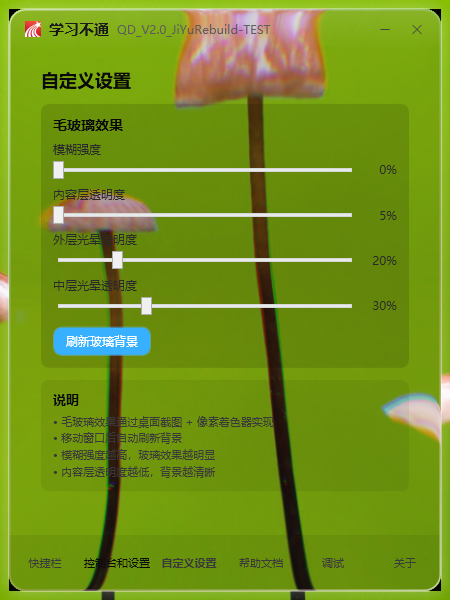

# Jiyuikiller2.0-Comprehensive-Restructuring

<p>基于 [JiYu Trainer](https://github.com/imengyu/JiYuTrainer) 的 fork</p>
<p>本项目原作者已经停止更新</p>
<p>该项目源于作者zsyn666的fork进行二改</p>
<p>合并了来自于作者BengbuGuards的MythwareToolkit作为子功能</p>
<p>合并了来自于作者weilycoder的Jiyu_replay_attack作为子功能</p>
<p>合并了来自于作者yunsjxh的Third-party-JiYu-Teacher-Endpoint作为子功能</p>
<p>界面参考：COUI（超椭圆/样式思路）、WPF-Liquid-Glass-Effect（着色器来源）、liquid-glass-js（折射配方）</p>


---

<p align="center">
  <a href="#">
    
  </a>
</p>
<p align="center">不再被极域电子教室控制</p>
<p align="center">制裁老毕登极域</p>

---
## 来自于zsyn666

## 简介

本软件研发目的就是为了对抗极域电子教室，如果您的学校机房使用极域电子教室来控制学生电脑的话，本软件很可能会帮到你。

> 讲师讲课无聊啰嗦缓慢？想自己试试操作，却被该死的全屏广播控制，什么都不能干？拔掉网线后虽然自由了但是又看不到老师的演示了？

如果你被以上问题困扰，本软件可能是您非常想要的。

这是一个可以使 **极域电子教室全屏广播失效** 的软件，也就是说，在被老师全屏广播时，会将其自动调整为窗口模式，你不仅可以自由操作电脑，也还可以看老师的演示，自由+学习两不误，这不是很爽的事情吗？其还可以防止被老师控制（有点狠），以及自动关闭 "**黑屏安静**" 这种东西；由于本软件是将全屏调整为窗口，因此老师并不会发现你断线或是进行了非法操作。

## 功能

* 在不影响极域正常运行的情况下将 全屏的广播 转为 窗口广播 模式，您不仅可自己操作，也可看老师讲解课程。
* 内置强杀、启停极域 StudentMain.exe 进程功能，无需依赖其他软件。
* 内置破解极域解锁卸载密码功能，支持新版极域。
* 反监视功能，经测试，开启反监视，教师端就无法监视您所用的电脑。
* **截图替换功能**：选择一张图片，教师端截屏/监视时看到的就是这张图片。
* 防控制功能，防止教师通过极域控制您所用的电脑。
* 监控极域远程执行命令，您可以自由选择是否允许教师端远程执行的命令。
* 通过极域电子教室对同学的电脑远程发送信息或远程执行命令。
* 极域工具包，支持极域以及学生机房管理助手的工具。

提示：**由于本软件会对极域电子教室进行必要的操作（远程注入、替换模块），某些杀毒软件可能会报毒，您可能需要关闭杀毒软件或添加白名单**。

## 效果展示

<p align="center">
  <a href="#">
    
  </a>
</p>

## 操作方法

本软件专为小白设计，默认情况下，您不需要修改任何参数，直接运行exe，并最小化即可，软件会自动进行操作。

> 附加说明：本软件不依赖任何运行库，您只需复制一个 **i.chaoxing.exe** (可能还是这个名字) 至目标电脑即可运行，本软件已将需要的DLL打包，它会自动进行安装。

## 使用的第三方库

*第三方库已经包含在项目中，不需要您自己安装*

- [Jiyu_udp_attack](https://github.com/ht0Ruial/Jiyu_udp_attack) (由ht0Ruial大佬提供UDP攻击的原理代码)
- [curl](https://github.com/curl/curl) (用于自动更新模块)
- [mhook](https://github.com/martona/mhook) (用于 JiYu HOOKER 模块)
- [MemoryModule](https://github.com/fancycode/MemoryModule)
- [XZip-XUnZip](https://github.com/yuanjia1011/XZip-XUnZip)
- [weilycoder](https://github.com/weilycoder/Jiyu_replay_attack)
- [BengbuGuards](https://github.com/weilycoder/Jiyu_replay_attack)
- [dragosniamtu](https://github.com/dragosniamtu/WPF-Liquid-Glass-Effect) (液态玻璃效果)

## 致谢

- 原作者 [imengyu](https://github.com/imengyu)（快乐的梦鱼）开发了 JiYu Trainer
- 二改作者 [zsyn666](https://github.com/zsyn666) 进行二改
- [weilycoder](https://github.com/weilycoder/Jiyu_replay_attack)
- [BengbuGuards](https://github.com/weilycoder/Jiyu_replay_attack)
- [dragosniamtu](https://github.com/dragosniamtu/WPF-Liquid-Glass-Effect) 的基于WPF的液态玻璃效果

## 许可

本项目以 **MIT License** 发布，见 [LICENSE](LICENSE)。

上游与第三方组件的许可、来源与改动说明见 [THIRD-PARTY-NOTICES.md](THIRD-PARTY-NOTICES.md)，许可原文在 [third_party/](third_party/)：
上游 JiYuTrainer（MIT）、WPF-Liquid-Glass-Effect（MIT）、COUI（Apache-2.0）、liquid-glass-js（MIT）、Jiyu_replay_attack（MIT）、Third-party-JiYu-Teacher-Endpoint（MIT）。

## 构建

- 环境：**Visual Studio 2019/2022 + .NET Framework 4.7.2 开发工具包**，目标框架 `net472`；**必须编译为 x86**（驱动与 DLL 注入是 32 位）。
- 命令行构建（用 VS 自带的 MSBuild）：

  ```
  MSBuild.exe JiYuKiller\JiYuKiller.csproj /p:Configuration=Release
  ```

  ⚠ **不要传 `/p:Platform=x86`** —— 本项目用的是 `AnyCPU` 配置名 + `PlatformTarget=x86` 绑定，传了会报"未设置 OutputPath"。
- **像素着色器**：`JiYuKiller\Effects\*.ps` 由同名 `.hlsl` 编译而来，改了 `.hlsl` 必须重编，否则改动**完全无效且不报错**：

  ```
  fxc /T ps_2_0 /E main /Fo NavBarLens.ps NavBarLens.hlsl
  ```

  ⚠ **`.hlsl` 不能带 UTF-8 BOM**：`fxc` 会把 BOM 当非法字符，直接报 `X3000: Illegal character (1,1)`。
- **源文件编码**：除 `.hlsl` 外，所有 `.cs` / `.xaml` 统一 **UTF-8 with BOM**（历史上曾因 GBK 保存导致中文注释与日志字符串成片乱码）。

## 免责声明

本项目仅供**学习与技术研究**使用：用于了解 Windows 内核驱动通信、DLL 注入与模块枚举、屏幕捕获，以及 WPF 自定义着色器与玻璃拟态渲染的实现方式。

请勿用于违反学校或单位规定、侵犯他人权益的用途。使用本软件产生的一切后果由使用者自行承担；若你所在环境不允许此类操作，请立即停止使用并删除本软件。

## 开发用自检钩子

| 环境变量 | 作用 |
|---|---|
| `JYKILLER_START_PAGE=<页面名>` | 指定启动页（`quick`/`settings`/`custom`/`advanced`/`games`…），便于截图核对各页面 |
| `JYKILLER_NAVLENS_SELFTEST=1` | 启动即执行底栏折射自检并导出对比 PNG |
| `JYKILLER_FORCE_SOFTWARE_RENDER=1` | 强制软件渲染，用于复现无 3D 的老机器/虚拟机（注意 `RenderCapability.Tier` 仍会报硬件层级） |
